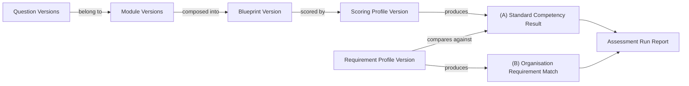

# Assessment Blueprint Engine — Architecture Review

**Status:** Approved architecture direction, corrected per Architecture Quality Review, pre-implementation. Documentation only — no code, migrations, or config accompany this set of documents.
**Audience:** Product Owner, future implementers (human or AI-assisted).
**Companion documents:** [DDD](./blueprint-engine-ddd.md) · [DB Schema](./blueprint-engine-db-schema.md) · [Frontend](./blueprint-engine-frontend.md) · [Backend](./blueprint-engine-backend.md) · [Migration Strategy](./blueprint-engine-migration-strategy.md) · [Risk Assessment](./blueprint-engine-risk-assessment.md)

> **Corrected per Architecture Quality Review** (findings C1, C2, C3,
> I1 addressed in this document; full finding list and disposition in
> [§11 below](#11-architecture-quality-review--corrections-applied)).
> The quality review cross-checked all seven documents against the
> live schema and found two undiscovered issues (C1, C2) that would
> have failed at implementation time as originally documented — both
> have narrow, additive fixes that do not change the overall
> architecture direction below.

## 1. Question posed

Is a single, configuration-driven **Assessment Blueprint Engine** —
generating org-side assessments (Recruitment, Annual Competency
Review, Supplier Audit, and future purposes) from a Purpose + Role +
Environment + Modules + Requirement Profile + Scoring Profile + Report
Profile — the correct long-term architecture for CQrityjob, versus
hardcoding assessments per industry/environment?

## 2. Verdict

**Yes, with one structural guardrail.** The concept is correct and
matches the platform's own existing design instincts (versioned
content, reusable vocabulary, RLS-gated state transitions). The single
condition that makes it safe: **assessment *content* is fully
data-driven; assessment *process* is not.**

- Content = which Roles, Environments, Modules, Questions, and weights
  compose a given Blueprint. Safe to be arbitrarily dynamic, editable
  by platform admins through the Universal Assessment Builder, no code
  changes required to add a new Role or Environment.
- Process = the state machine governing draft → published → archived
  Blueprint Versions, and the assessment-run lifecycle (started →
  submitted → scored → reported). This must remain hardcoded
  `CASE`-statement allow-lists inside `SECURITY DEFINER` RPCs, exactly
  like every other domain in this codebase (`moderate_employer()`,
  `reject_job()`, `set_application_status()`). No table of "allowed
  transitions" is ever read at runtime to decide whether a transition
  is legal.

Conflating the two — letting the state machine itself become
database-editable configuration — is exactly the class of bug the H3.3
hardening passes existed to close (an RLS-permitted direct write
bypassing an application-layer-only check). The Blueprint Engine must
not reopen that door by generalizing further than this guardrail
allows.

## 3. Current platform — what this builds on

| Capability | Status today |
|---|---|
| Authentication | Supabase Auth, shared across candidate/employer |
| Candidate accounts, applications, CV upload | Live (H3.4) |
| Employer accounts, memberships, dashboard | Live (G1–G3) |
| Job management, moderation | Live (H3.x), `SECURITY DEFINER` RPC pattern established |
| Career Intelligence Graph (`cig_*`, 31 tables) | Schema live, `GRAPH_ACTIVATION_STATE = "legacy"`, partially seeded |
| Career Intelligence Engine (`computeEngineResultV1`) | Live, scores against 14 hardcoded dimensions |
| Public 16-question Security Career Assessment | Live, `assessment_runs` / `assessment_run_reports` |
| Assessment template / question bank / role profile / campaign tables | **Do not exist** |
| Billing, credits, notifications/email infra, partner API | **Do not exist** |

Everything below builds on this foundation additively. No parallel
employer, candidate, assessment-run, or reporting system is created.

## 4. Verified grounding (repo audit)

Independently confirmed against the repository, not assumed from the
product specs:

- **`cig_*` schema exists exactly as described**: 31 tables
  (`supabase/migrations/20260717064956_c64dae88-...sql`), every
  entity/relationship row `graph_version`-stamped.
- **Meaningfully seeded**: `cig_competencies` (18 rows),
  `cig_work_environments` (7), `cig_skills` (14),
  `cig_knowledge_areas` (10), `cig_employer_types` (9),
  `cig_profession_competency_req` (~20) — real bilingual content.
- **Thin**: `cig_professions` has only 2 rows — `vaktare` (Security
  Officer) and `ordningsvakt`. The approved launch catalogue needs
  Security Officer *and* Security Supervisor — these are not the same
  pair. Resolved explicitly in §7 and in the DDD/Migration docs: a new
  `cig_professions` row is authored for Security Supervisor through
  the graph's normal content pipeline, not as a Blueprint-local shadow
  role.
- **Empty**: `cig_assessment_signals` / `cig_profession_assessment_signals`
  — zero seed rows. Right shape for a Scoring Profile, needs first-time
  content authoring.
- **Unresolved graph references**: some relationship tables reference
  profession slugs (`sakerhetschef`, `polis`, `brandman`, etc.) not
  present in the seeded `cig_professions` rows. Flagged as a one-time
  data-integrity audit item ([Migration Strategy](./blueprint-engine-migration-strategy.md)), not a blocker.
- **H3.x moderation convention verified as the binding precedent**:
  one `SECURITY DEFINER` RPC per state transition, hardcoded allow-list,
  one dedicated audit table per domain, RLS grants no direct
  `UPDATE`/`INSERT` on status-bearing tables.
- **`CareerProfileForJobsV1`** (`src/lib/career-intelligence-engine/profile-for-jobs.ts`)
  is the existing precedent for a versioned, Zod-validated output
  contract — the model for Scoring Profile output shape.
- **Scale discrepancy, decided**: production uses a 1–5 rating scale
  (`src/lib/assessment-content.ts`); the v1.2 draft spec states 1–10.
  **PO decision: keep 1–5** for this build (§8) — the architecture
  supports either per-question, so this can be revisited later with
  zero migration cost.
- **Undiscovered catalog reuse opportunity, found during quality
  review**: `public.assessments`/`public.assessment_versions` already
  exist (`supabase/migrations/20260716153446_...sql`) and
  `assessment_runs.assessment_id`/`.assessment_version_id` are
  `NOT NULL` references into them. The original draft of this
  document set did not discover this and proposed `blueprints`/
  `blueprint_versions` as fully standalone — corrected (finding C1):
  every Blueprint/Blueprint Version now mirrors a row in this existing
  catalog rather than creating a parallel one. See
  [DB Schema §5](./blueprint-engine-db-schema.md#5-catalog-bridge-to-assessments--assessment_versions-fixes-c1).
- **`assessment_runs.status` constraint verified**: the real `CHECK`
  constraint is `('in_progress','completed','abandoned')`
  (`supabase/migrations/20260717052749_...sql`). The original draft's
  Backend RPC inventory assumed `'submitted'`/`'scored'` states that
  do not exist — corrected (finding C2) to reuse the existing three
  values plus a new, additive `blueprint_run_stage` column for
  finer-grained progress. See
  [Backend §2](./blueprint-engine-backend.md#2-rpc-inventory).

## 5. Alternatives considered

| Alternative | Why rejected |
|---|---|
| Hardcode each new assessment (Datacenter, Airport, Hospital…) as its own module/route, as the original v1.3 spec's Product B/C implied | Does not scale past a handful of industries; every new customer vertical becomes a code change, contradicting the owner's explicit goal of "hundreds of future roles/industries without new code" |
| Build the Blueprint Engine as an entirely new schema, parallel to `cig_*` | Duplicates already-seeded, working vocabulary; violates the owner's explicit "do not design a parallel system" instruction; doubles the maintenance surface for Role/Environment/Competency data |
| Fully data-driven state machine (transitions stored as editable rows) | Reopens the RLS-bypass class of vulnerability H3.3 closed; rejected per the process-vs-content guardrail (§2) |
| Immediately migrate the public 16-question assessment onto the new schema | Touches a live, working, operationally different product (personality/preference-oriented vs. scenario/knowledge-oriented) for no MVP benefit; rejected in favor of a documented convergence path (§8, DDD §6) |
| Employer self-service Requirement Profile creation at launch | Out of MVP scope per owner decision; mechanism is built, but creation is platform-admin-only until self-service is explicitly approved |

## 6. Domain model summary

Full detail in [DDD](./blueprint-engine-ddd.md). Headline shift from
earlier drafts: **no rigid `Question → Evidence → Dimension →
Competency → Module → Blueprint` hierarchy.** Questions, Modules,
Roles, and Environments relate many-to-many through explicit,
versioned association entities. A Module is a reusable composition
layer, not an owner of questions.

Every Assessment Run produces two structurally separate results:

- **(A) Standard Competency Result** — against the versioned Blueprint
  + Scoring Profile only.
- **(B) Organisation Requirement Match** — a read-only derived
  comparison of (A) against the org's Requirement Profile. Never
  writes back to (A); never produces an automatic accept/reject or
  compliance decision.

## 7. Bounded context and naming

The engine is a reusable **Assessment Intelligence** capability, not a
recruitment feature — Recruitment is the first employer-facing journey
built on top of it, not its owner. Schema, RPC, and package naming use
`assessment-intelligence` / `blueprint` vocabulary; purpose-specific
framing (Recruitment vs. Annual Review vs. Supplier Audit copy) lives
only in the thin journey/UI layer. This keeps the door open — at low
present cost — for future journeys (Annual Competency Review, Supplier
Assurance, Onboarding, Training Follow-up, Certification, Promotion
Assessment, Career Development, Learning Recommendations, Workforce
Intelligence, Site/Team Competency Mapping, a future AI Career Coach,
a future Security Manager Assistant, future partner/white-label/API
products) without renaming or restructuring the core engine later.
None of these are built now.

## 8. Product Owner decisions

Decided during the Architecture Quality Review round:

1. **Rating scale**: ~~open~~ **decided — keep the production 1–5
   scale.** The v1.2 draft's 1–10 is not adopted. Zero migration cost
   to revisit later since scale is a per-Question-Version property.
2. **Employer self-service Requirement Profile creation**: ~~open~~
   **decided — stays platform-admin-only for this build.** No target
   date set for turning on self-service; revisit after Phase 1's
   admin-only flow has run through at least one real customer cycle.
3. **Scoring Profile cardinality**: ~~open~~ **decided — exactly one
   `published` Scoring Profile Version per Blueprint Version at a
   time** (finding I3). Multi-profile A/B support explicitly deferred.
4. **`purpose`/`assessment_level` modeling**: ~~open~~ **decided —
   data-driven lookup tables**, not hardcoded CHECK lists (finding
   I1), matching the treatment already given to Role/Environment.
5. **Timing of public-assessment convergence** (DDD §6): **decided —
   deferred until the Recruitment journey has been live and stable for
   a full quarter**, as a separately-scoped initiative.

**Still genuinely unresolved, not assumed anywhere in this document
set:**

6. **GDPR/retention duration** for recurring annual assessments and
   historical comparison data — needs explicit DPO input **before the
   Annual Review journey is built**, not before this first build (which
   does not include that journey and therefore accumulates no
   recurring-assessment history under this open question).

## 9. MVP boundary (this build)

**In scope:** generic Blueprint Engine schema and RPCs; 2 roles
(Security Officer, Security Supervisor — the latter newly authored,
§4) × 2 environments (General Security, Datacenter); minimum
Modules/Questions/Scoring Profile to prove the engine end-to-end;
admin-only Universal Assessment Builder; Recruitment journey only;
deterministic template reports; Requirement Profile mechanism,
admin-created only.

**Explicitly out of scope, later phases only:** employer self-service
Requirement Profile creation; billing/credits; public partner API;
white-label UI; AI-generated narratives; full organisation hierarchy;
all assessment purposes simultaneously; automatic/adaptive migration
of the public assessment onto the Blueprint Engine.

## 10. Acceptance criteria for this architecture

- [ ] No Role, Environment, or Module can be added to the launch
      catalogue without a data change — verified by adding a
      hypothetical third role/environment via `is_assessable` flags
      alone, no code change.
- [ ] Every Blueprint/Module/Question/Scoring Profile state transition
      is implemented as a `SECURITY DEFINER` RPC with a hardcoded
      allow-list; no table drives transition legality at runtime.
- [ ] (A) and (B) results are stored in structurally distinct
      columns/tables; a code review can confirm no write path from a
      Requirement Profile computation into (A)'s columns.
- [ ] A historical Assessment Run remains fully reproducible from the
      Blueprint/Module/Question/Scoring-Profile *versions* pinned at
      run-start time, even after later edits to the (mutable) draft
      heads.
- [ ] The public assessment's routes, tables it doesn't already share,
      and scoring function are unmodified by this build.
- [ ] Every Blueprint/Blueprint Version that reaches `published`
      status has a corresponding mirrored row in the pre-existing
      `assessments`/`assessment_versions` catalog — no second catalog
      exists (fixes C1).
- [ ] No RPC anywhere in this design writes a value to
      `assessment_runs.status` other than the three that already exist
      in production (fixes C2).
- [ ] No `authenticated`-reachable role can `DELETE` a published,
      historically-referenced version row — `RESTRICT` FKs plus a
      denied `DELETE` policy make this structural, not conventional
      (fixes C3).

## 11. Architecture Quality Review — corrections applied

A full quality review (12-point checklist: contradictions, missing
entities, duplicate sources of truth, versioning/immutability gaps,
RLS/RPC weaknesses, Requirement-Profile-write-path safety, parallel-
system risk, auditability, MVP scope creep, future-purpose blockers,
GDPR/discrimination/accessibility risk, additive-migration safety) was
run across all seven documents before implementation, cross-checked
against the live schema rather than only against the documents
themselves. Verdict: **Approve with corrections** — the architecture
direction, domain model, and process/content guardrail were confirmed
sound; three Critical and seven Important findings required narrow,
additive corrections, now applied throughout this document set:

| ID | Finding | Corrected in |
|---|---|---|
| C1 | `assessments`/`assessment_versions` already exist and are `NOT NULL`-referenced by `assessment_runs`; original design risked a parallel catalog | [DB Schema §5](./blueprint-engine-db-schema.md#5-catalog-bridge-to-assessments--assessment_versions-fixes-c1), [Backend §3](./blueprint-engine-backend.md#3-catalog-bridge-to-assessments--assessment_versions-fixes-c1), [DDD](./blueprint-engine-ddd.md) |
| C2 | `assessment_runs.status` CHECK constraint doesn't include the states originally assumed | [DB Schema §6](./blueprint-engine-db-schema.md#6-extended-existing-tables-additive-only-corrected-order), [Backend §2](./blueprint-engine-backend.md#2-rpc-inventory) |
| C3 | RLS never denied `DELETE`; association FKs used `CASCADE` on immutable/historical entities | [DB Schema §3–§5, §9](./blueprint-engine-db-schema.md), [DDD §8](./blueprint-engine-ddd.md#8-acceptance-criteria-domain-model) |
| I1 | `purpose`/`assessment_level` were hardcoded CHECK lists, contradicting the no-code-to-extend requirement | [DB Schema §1](./blueprint-engine-db-schema.md#1-lookup-tables--purpose-and-assessment-level-fixes-i1) |
| I2 | DB Schema doc's own section order forward-referenced undefined tables | [DB Schema](./blueprint-engine-db-schema.md) (reordered) |
| I3 | Scoring Profile Version cardinality per Blueprint Version was ambiguous | [DB Schema §4](./blueprint-engine-db-schema.md#4-new-tables--blueprints-scoring-requirement-profiles), [Backend §2](./blueprint-engine-backend.md#2-rpc-inventory) |
| I4 | `environment_competency_requirements` had no defined consumer | [DB Schema §3](./blueprint-engine-db-schema.md#3-new-tables--associations-the-many-to-many-layer), [Frontend §2](./blueprint-engine-frontend.md#2-universal-assessment-builder--8-steps) |
| I5 | Vocabulary mutability narrowed the reproducibility guarantee | [Backend §6](./blueprint-engine-backend.md#6-report-pipeline), [DDD §8](./blueprint-engine-ddd.md#8-acceptance-criteria-domain-model) |
| I6 | Draft Requirement Profile visibility to employers was ambiguous | [DB Schema §9](./blueprint-engine-db-schema.md#9-rls-model) |
| I7 | `SECURITY DEFINER` "grant" framing was technically imprecise | [Backend §5](./blueprint-engine-backend.md#5-scoring-pipeline), [DDD §5](./blueprint-engine-ddd.md#5-standard-result-vs-organisation-match--structural-separation) |

Five Later-tier observations (human-review UX, bias-detection
heuristics, per-computation audit logging, report-column shape,
glossary wording precision) were noted but not required before
implementation — see [Risk Assessment](./blueprint-engine-risk-assessment.md)
and [Migration Strategy](./blueprint-engine-migration-strategy.md) for
where they're tracked.
