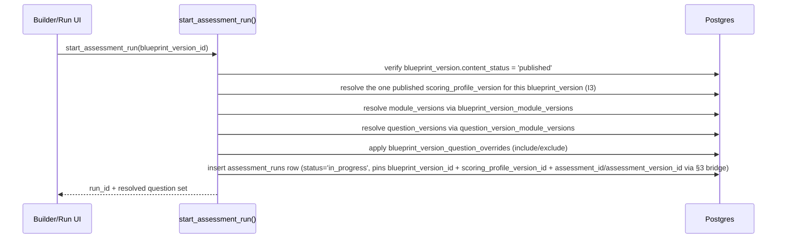
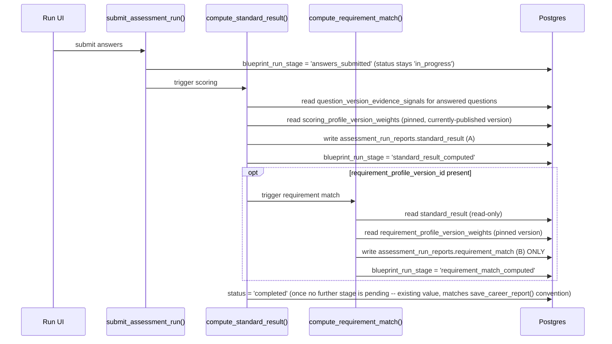

# Assessment Blueprint Engine — Backend Architecture

**Companion to:** [DB Schema](./blueprint-engine-db-schema.md) · [DDD](./blueprint-engine-ddd.md)

> **Corrected per Architecture Quality Review** (findings C1, C2, C3,
> I3, I7 addressed in this document).

## 1. Governing principle: content is data, process is code

Restated because it is the single most important guardrail in this
document set (see [Architecture Review §2](./blueprint-engine-architecture-review.md#2-verdict)):
which Roles/Environments/Modules/Questions compose a Blueprint is
fully data-driven. Whether a Blueprint Version, Module Version,
Question Version, Scoring Profile Version, or Requirement Profile
Version is allowed to move from `draft` to `published` to `archived`
is a hardcoded `CASE`-statement allow-list inside a `SECURITY DEFINER`
RPC — never a database-editable rule.

This is a direct extension of the existing pattern already proven in
this codebase:

| Existing domain | RPC | Audit table |
|---|---|---|
| Employer moderation | `moderate_employer()` | `employer_moderation_events` |
| Job rejection | `reject_job()` | `job_admin_meta` |
| Application status | `set_application_status()` | `job_application_status_events` |

Every RPC below follows the same shape: derive actor identity
server-side (`auth.uid()`), enforce a hardcoded transition allow-list,
write one atomic audit row, and never trust a client-supplied role,
status, or ID beyond the primary key being operated on.

## 2. RPC inventory

| RPC | Purpose | Allow-listed transitions | Audit table |
|---|---|---|---|
| `create_question_draft()` | Create a new Question + first draft Version | n/a → `draft` | `question_content_events` |
| `publish_question_version()` | Freeze a draft Question Version | `draft → published` | `question_content_events` |
| `archive_question_version()` | Retire a published version from future selection | `published → archived` | `question_content_events` |
| `create_module_draft()` / `publish_module_version()` / `archive_module_version()` | Same pattern for Modules | as above | `module_content_events` |
| `create_blueprint_draft()` | Create a new Blueprint + first draft Version, requires `role_id`/`environment_id`/`purpose_id`/`assessment_level_id` already `is_assessable = true`. **Fixes C1**: also inserts the mirrored `assessments` row (`kind = 'professional'`) for this Blueprint — see §3 | n/a → `draft` | `blueprint_content_events` |
| `attach_module_to_blueprint_version()` / `detach_module_from_blueprint_version()` | Edit a **draft** Blueprint Version's module composition | only while `content_status = 'draft'` | `blueprint_content_events` |
| `set_blueprint_version_question_override()` | Explicit include/exclude of a Question Version | only while `content_status = 'draft'` | `blueprint_content_events` |
| `publish_blueprint_version()` | Freeze a draft Blueprint Version. **Fixes C1**: also inserts the mirrored `assessment_versions` row and sets `blueprint_versions.assessment_version_id` in the same transaction — see §3 | `draft → published`, requires ≥1 attached Module Version | `blueprint_content_events` |
| `archive_blueprint_version()` | Retire a published Blueprint Version | `published → archived` | `blueprint_content_events` |
| `create_scoring_profile_draft()` | Create a draft Scoring Profile Version scoped to one Blueprint Version | n/a → `draft` | `scoring_profile_content_events` |
| `publish_scoring_profile_version()` | Freeze a draft Scoring Profile Version. **Fixes I3**: requires no other `scoring_profile_versions` row for the same `blueprint_version_id` is currently `published` — archives are fine, but the RPC raises if a published sibling exists, so exactly one is active at a time (the partial unique index in [DB Schema §4](./blueprint-engine-db-schema.md#4-new-tables--blueprints-scoring-requirement-profiles) makes this structural, not just RPC logic) | `draft → published`, requires zero currently-`published` siblings | `scoring_profile_content_events` |
| `archive_scoring_profile_version()` | Required before publishing a replacement Scoring Profile Version for the same Blueprint Version | `published → archived` | `scoring_profile_content_events` |
| `create_requirement_profile_draft()` | Platform-admin-only in this build (PO-confirmed); scoped to one `employer_id` | n/a → `draft` | `requirement_profile_events` |
| `publish_requirement_profile_version()` | Freeze a Requirement Profile Version | `draft → published` | `requirement_profile_events` |
| `start_assessment_run()` | Begin a run, pins `blueprint_version_id`/`scoring_profile_version_id` (resolved to the one currently-published Scoring Profile Version, per I3 — never client-supplied)/optional `requirement_profile_version_id`. **Fixes C2**: writes `assessment_runs.status = 'in_progress'`, the existing default value — no new status is introduced | n/a → `in_progress` (existing value) | existing `assessment_runs` audit pattern |
| `submit_assessment_run()` | Finalize answers. **Fixes C2**: writes `blueprint_run_stage = 'answers_submitted'` on the new additive column; `assessment_runs.status` remains `'in_progress'` (existing value) until scoring completes | `blueprint_run_stage`: n/a → `answers_submitted` | same |
| `compute_standard_result()` | Deterministic scoring, writes **only** `assessment_run_reports.standard_result`. **Fixes C2**: sets `blueprint_run_stage = 'standard_result_computed'`; sets `assessment_runs.status = 'completed'` (the existing terminal value, matching `save_career_report()`'s established convention exactly) once no Requirement Profile is attached, or leaves `status = 'in_progress'` if a requirement match still needs to run | `blueprint_run_stage`: `answers_submitted → standard_result_computed`; `status`: `in_progress → completed` (existing values only) | same |
| `compute_requirement_match()` | Derived comparison, writes **only** `assessment_run_reports.requirement_match`; has no code path that writes `standard_result` (see §4, corrected per I7). Sets `blueprint_run_stage = 'requirement_match_computed'` and `assessment_runs.status = 'completed'` | `blueprint_run_stage`: `standard_result_computed → requirement_match_computed`; `status`: `in_progress → completed` (existing values only) | same |

Every `publish_*` RPC checks `is_platform_admin()` in this build —
including `publish_requirement_profile_version()`, since Requirement
Profile *creation* is admin-only until employer self-service is
explicitly turned on in a later phase (PO-confirmed for this MVP).

No RPC in this table ever writes `assessment_runs.status` to any value
other than the three that already exist in production
(`'in_progress'`, `'completed'`, `'abandoned'`) — this replaces the
original draft's invented `'submitted'`/`'scored'` values, which do
not exist in the real `CHECK` constraint and would have failed at
runtime (finding C2).

## 3. Catalog bridge to `assessments` / `assessment_versions` (fixes C1)

`assessment_runs.assessment_id` and `.assessment_version_id` are
pre-existing `NOT NULL` columns. Two RPCs above are responsible for
keeping every Blueprint fully compatible with them, atomically:

```mermaid
sequenceDiagram
    participant Admin as Platform Admin
    participant Create as create_blueprint_draft()
    participant Publish as publish_blueprint_version()
    participant DB as Postgres

    Admin->>Create: create_blueprint_draft(purpose_id, role_id, environment_id, level_id)
    Create->>DB: INSERT blueprints (draft parent row)
    Create->>DB: INSERT assessments (kind='professional', mirrors this blueprint)
    Create->>DB: INSERT blueprint_versions (content_status='draft')
    Create-->>Admin: blueprint_id, blueprint_version_id

    Admin->>Publish: publish_blueprint_version(blueprint_version_id)
    Publish->>DB: verify >=1 attached module_version
    Publish->>DB: INSERT assessment_versions (mirrors this blueprint_version)
    Publish->>DB: UPDATE blueprint_versions SET assessment_version_id = <new row>, content_status = 'published'
    Publish-->>Admin: published
```

`start_assessment_run()` then reads `blueprint_versions.assessment_version_id`
and `blueprints`' mirrored `assessments.id` to populate
`assessment_runs.assessment_id`/`.assessment_version_id` — the exact
same columns a public-assessment run already populates today. No
second catalog concept is introduced; `assessments`/`assessment_versions`
remain the single source of truth for "what is this run of," for both
the legacy public assessment and every Blueprint.

## 4. Assessment generation pipeline

Blueprint "compilation" — turning a published Blueprint Version into
an actual runnable question set — is a **deterministic read-time
join**, not a materialization/copy step:



Because resolution happens at run-start against **published,
immutable** versions, editing a *draft* Blueprint or Module never
risks corrupting an in-flight or historical run — the draft simply
isn't reachable by `start_assessment_run()` until published.

## 5. Scoring pipeline

Reuses the existing `scoreOne()` core
(`src/lib/career-intelligence-engine/scoring.ts`), generalized to take
a **parameterized dimension/module set** (from the Scoring Profile
Version) instead of the hardcoded 14 `DimensionId`s. This is a
refactor of the function's *input shape*, not a new scoring engine —
the existing evidence-aggregation and weighting math is unchanged.



**Corrected per I7**: `compute_requirement_match()`'s inability to
write `standard_result` is **not** enforced by a Postgres column-level
`GRANT`. A `SECURITY DEFINER` function executes with the *function
owner's* full privileges regardless of what is granted to the calling
role — so a per-column `GRANT` to the caller would not actually
constrain the function body even if one existed. The real, and only,
enforcement mechanism is that `compute_requirement_match()`'s
implementation simply contains no `UPDATE ... SET standard_result`
statement anywhere in its body — identical in kind to how
`reject_job()` enforces "approval is unaffected by this fix" today:
by what the function's code does and does not do, verified by code
review and by test coverage (see the acceptance criterion in §9),
not by a database-level grant barrier. This is the same trust boundary
every other `SECURITY DEFINER` RPC in this codebase already relies on.

## 6. Report pipeline

Deterministic, template-based only in this build — reuses the
existing structured-explanation pattern proven in the Career
Intelligence Engine (`src/lib/career-intelligence-engine/index.ts`'s
explanation layer), applied to the generalized dimension/module set.
No AI/LLM call is made anywhere in this pipeline. `ai_narrative`
remains `NULL` and unused; adding a future AI-narrative step is
additive (a new optional pipeline stage writing that one column) and
requires no schema change when it happens.

**Fixes I5**: at generation time, `compute_standard_result()` and
`compute_requirement_match()` snapshot the *display labels* (Evidence
Signal titles, Competency titles) referenced by the run into the
report JSONB payload itself, not just their IDs. `evidence_signals`
and `cig_*` vocabulary rows are edited in place (not versioned, per
[DDD §4](./blueprint-engine-ddd.md#4-entity-ownership-cardinality-versioning-table)),
so a later edit to a title/description must not silently change how a
historical report reads. This mirrors the existing
`assessment_run_reports.report`-style snapshot pattern already used in
production. The reproducibility guarantee is therefore precise:
**scores, structure, and displayed wording are all reproducible from
the pinned versions and the snapshot taken at generation time** — not
merely "scores stay correct while wording could silently drift," which
was the gap identified in the review.

## 7. Non-negotiable integrity principles (enforced in code, not just policy)

- **AI explains; deterministic rules calculate.** No scoring path in
  this pipeline calls any AI/LLM service — verified by the absence of
  any AI/LLM dependency in this build (none exists in the codebase
  today).
- **AI never changes scores; AI never approves or rejects a
  candidate.** No RPC in §2 accepts a client-supplied score, result,
  or decision value — every score is computed server-side from pinned
  versions and stored answers.
- **The platform provides decision support only.** No RPC or table in
  this design has an "approved"/"rejected"/"compliant" outcome field —
  employers act on the report; the platform does not emit a decision.
- **Published content and scoring logic are versioned and auditable**
  — enforced by [DB Schema §8](./blueprint-engine-db-schema.md#8-versioning--publication-rules)
  and the audit-table-per-domain pattern in §2 above.
- **Historical results remain reproducible** — guaranteed by pinning
  `blueprint_version_id`/`scoring_profile_version_id`/
  `requirement_profile_version_id` at `start_assessment_run()`
  (structurally undeletable per C3), plus the §6 label-snapshot
  correction (I5) for displayed wording.

## 8. Error handling

Following the existing `reject_job()`/`moderate_employer()` pattern:
RPCs raise a `RAISE EXCEPTION` with a stable, human-readable message
(never a raw Postgres constraint error) for expected failure cases
(e.g. "Cannot publish a blueprint version with zero attached
modules", "A published scoring profile version already exists for
this blueprint version"); the calling application layer
(`*.functions.ts`, following the existing `admin.functions.ts`/
`membership.functions.ts` convention) catches and maps these to
user-facing copy — no raw DB/server error ever reaches the UI,
matching the H3.4 job-rejection fix's established convention.

## 9. MVP vs. later boundary (backend)

**Built now:** every RPC in §2, scoped to the 2×2 launch catalogue;
generalized `scoreOne()`; deterministic report generation; the C1
catalog bridge; exactly-one-published-Scoring-Profile-Version
enforcement (I3).

**Not built now:** any AI-narrative generation service or prompt/model
integration; any billing/entitlement check inside these RPCs (none
exists to check against); any public partner-API surface (these RPCs
are called from the authenticated app only, never exposed as a public
API in this build); any employer self-service Requirement Profile
creation RPC variant (the RPCs exist, gated to admin-only callers,
PO-confirmed); multi-profile Scoring Profile support (I3, PO-confirmed
deferred).

## 10. Acceptance criteria (backend)

- [ ] `compute_requirement_match()`'s source code contains no
      statement writing `standard_result` — verified by code review
      and a test that attempts to detect any change to
      `standard_result` after calling it.
- [ ] No RPC in §2 accepts a client-supplied `content_status`,
      `score`, or decision value as an argument that is written
      verbatim without server-side derivation/validation.
- [ ] No RPC in §2 writes `assessment_runs.status` to any value other
      than `'in_progress'`, `'completed'`, or `'abandoned'`.
- [ ] `start_assessment_run()` rejects a `blueprint_version_id` whose
      `content_status != 'published'`, and successfully populates
      `assessment_id`/`assessment_version_id` via the §3 bridge on
      every call.
- [ ] `publish_scoring_profile_version()` fails if a `published`
      sibling already exists for the same `blueprint_version_id`.
- [ ] Every RPC in §2 has a corresponding row-producing audit table
      entry on every successful call — verified by test coverage
      mirroring the existing `tests/database/phase-*` pattern.
