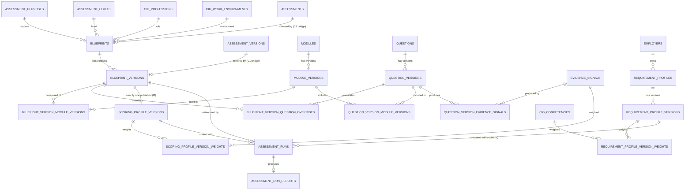

# Assessment Blueprint Engine — Database Architecture

**Companion to:** [DDD](./blueprint-engine-ddd.md) · [Backend](./blueprint-engine-backend.md) · [Migration Strategy](./blueprint-engine-migration-strategy.md)

> **Corrected per Architecture Quality Review** (findings C1, C2, C3,
> I1, I2, I3, I6 addressed in this document). Section order below is
> the actual dependency order — tables are defined before anything
> that references them (fixes I2).

All tables below follow existing repo conventions: `id uuid primary
key default gen_random_uuid()`, `created_at`/`updated_at timestamptz`,
`content_status text CHECK (content_status IN ('draft','published','archived'))`
matching the `cig_*` pattern, and **no direct client
`INSERT`/`UPDATE`/`DELETE` RLS policy on any status-bearing or
published-immutable table** — all writes go through `SECURITY
DEFINER` RPCs (see [Backend](./blueprint-engine-backend.md)).

## 1. Lookup tables — Purpose and Assessment Level (fixes I1)

Earlier drafts modeled `purpose` and `assessment_level` as
CHECK-constrained `text` columns. **Corrected**: this directly
contradicted the owner's explicit "no code change to add a future
purpose/level, where low-cost to avoid" requirement, and caused a real
cross-document contradiction (DDD §6's convergence path named
`purpose = 'career_self_assessment'`, a value the old CHECK list did
not allow). Purpose and Assessment Level are now data-driven lookup
tables, matching the treatment already given to Role and Environment:

```sql
CREATE TABLE public.assessment_purposes (
  id uuid PRIMARY KEY DEFAULT gen_random_uuid(),
  slug text NOT NULL UNIQUE,          -- 'recruitment', 'annual_competency_review', 'career_self_assessment', ...
  title_sv text NOT NULL,
  title_en text NOT NULL,
  is_assessable boolean NOT NULL DEFAULT false,   -- curated launch subset, same convention as Role/Environment
  created_at timestamptz NOT NULL DEFAULT now(),
  updated_at timestamptz NOT NULL DEFAULT now()
);

CREATE TABLE public.assessment_levels (
  id uuid PRIMARY KEY DEFAULT gen_random_uuid(),
  slug text NOT NULL UNIQUE,          -- 'baseline', 'standard', 'advanced', ...
  title_sv text NOT NULL,
  title_en text NOT NULL,
  is_assessable boolean NOT NULL DEFAULT false,
  created_at timestamptz NOT NULL DEFAULT now(),
  updated_at timestamptz NOT NULL DEFAULT now()
);
```

Adding a new Purpose (e.g. `onboarding`) or Level later is a data
insert, not a schema/code change. Launch content seeds exactly:
`recruitment` (`is_assessable = true`; the other five Purpose values
from the original brief — `annual_competency_review`,
`supplier_audit`, `post_training_evaluation`, `promotion_assessment`,
`certification` — are seeded `is_assessable = false`, selectable by
admins for future authoring but not yet exposed to any employer
journey), and `baseline` (`is_assessable = true`; `standard`/`advanced`
seeded `false`).

## 2. New tables — Libraries

```sql
CREATE TABLE public.evidence_signals (
  id uuid PRIMARY KEY DEFAULT gen_random_uuid(),
  slug text NOT NULL UNIQUE,
  title_sv text NOT NULL,
  title_en text NOT NULL,
  description_sv text,
  description_en text,
  created_at timestamptz NOT NULL DEFAULT now(),
  updated_at timestamptz NOT NULL DEFAULT now()
);

CREATE TABLE public.questions (
  id uuid PRIMARY KEY DEFAULT gen_random_uuid(),
  slug text NOT NULL UNIQUE,
  created_at timestamptz NOT NULL DEFAULT now(),
  updated_at timestamptz NOT NULL DEFAULT now()
);

CREATE TABLE public.question_versions (
  id uuid PRIMARY KEY DEFAULT gen_random_uuid(),
  question_id uuid NOT NULL REFERENCES public.questions(id) ON DELETE CASCADE,
  version_number integer NOT NULL,
  content_status text NOT NULL DEFAULT 'draft'
    CHECK (content_status IN ('draft','published','archived')),
  question_type text NOT NULL CHECK (question_type IN ('single','multi','rating','scenario')),
  scale_min integer,             -- nullable for non-rating types
  scale_max integer,             -- per-question, not global (production public assessment uses 1-5 -- see PO decision, Architecture Review §8)
  text_sv text NOT NULL,
  text_en text NOT NULL,
  options jsonb,
  published_at timestamptz,
  created_at timestamptz NOT NULL DEFAULT now(),
  updated_at timestamptz NOT NULL DEFAULT now(),
  UNIQUE (question_id, version_number)
);

CREATE TABLE public.modules (
  id uuid PRIMARY KEY DEFAULT gen_random_uuid(),
  slug text NOT NULL UNIQUE,
  created_at timestamptz NOT NULL DEFAULT now(),
  updated_at timestamptz NOT NULL DEFAULT now()
);

CREATE TABLE public.module_versions (
  id uuid PRIMARY KEY DEFAULT gen_random_uuid(),
  module_id uuid NOT NULL REFERENCES public.modules(id) ON DELETE CASCADE,
  version_number integer NOT NULL,
  content_status text NOT NULL DEFAULT 'draft'
    CHECK (content_status IN ('draft','published','archived')),
  title_sv text NOT NULL,
  title_en text NOT NULL,
  published_at timestamptz,
  created_at timestamptz NOT NULL DEFAULT now(),
  updated_at timestamptz NOT NULL DEFAULT now(),
  UNIQUE (module_id, version_number)
);
```

`questions` and `modules` (the *logical*, unversioned parent rows) may
still be `ON DELETE CASCADE`d by their own `*_versions` children only
in the direction parent→children of an entity that has **never been
published** — this is unaffected by C3, which concerns association
FKs pointing *at* `*_versions` rows (§3–§4 below), not a `*_versions`
row's FK back to its own unversioned parent.

## 3. New tables — Associations (the many-to-many layer)

**Corrected per C3**: every FK in this section that points at a
`*_versions` table uses `ON DELETE RESTRICT`, not `CASCADE`. A
`*_versions` row that is `published` (and therefore potentially
referenced by a historical `assessment_runs` row) must be structurally
undeletable — `RESTRICT` makes the delete fail with a Postgres FK
violation rather than silently cascading. Combined with the RLS
correction in §7 (no `DELETE` grant to `authenticated` at all), this
closes the historical-reproducibility gap identified in the review.

```sql
CREATE TABLE public.question_version_evidence_signals (
  id uuid PRIMARY KEY DEFAULT gen_random_uuid(),
  question_version_id uuid NOT NULL REFERENCES public.question_versions(id) ON DELETE RESTRICT,
  evidence_signal_id uuid NOT NULL REFERENCES public.evidence_signals(id) ON DELETE RESTRICT,
  signal_weight numeric NOT NULL DEFAULT 1.0,
  signal_polarity smallint NOT NULL DEFAULT 1,
  created_at timestamptz NOT NULL DEFAULT now(),
  UNIQUE (question_version_id, evidence_signal_id)
);

CREATE TABLE public.question_version_module_versions (
  id uuid PRIMARY KEY DEFAULT gen_random_uuid(),
  question_version_id uuid NOT NULL REFERENCES public.question_versions(id) ON DELETE RESTRICT,
  module_version_id uuid NOT NULL REFERENCES public.module_versions(id) ON DELETE RESTRICT,
  display_order integer NOT NULL DEFAULT 0,
  created_at timestamptz NOT NULL DEFAULT now(),
  UNIQUE (question_version_id, module_version_id)
);

CREATE TABLE public.module_version_competencies (
  id uuid PRIMARY KEY DEFAULT gen_random_uuid(),
  module_version_id uuid NOT NULL REFERENCES public.module_versions(id) ON DELETE RESTRICT,
  competency_id uuid NOT NULL REFERENCES public.cig_competencies(id) ON DELETE RESTRICT,
  importance smallint NOT NULL DEFAULT 1,
  created_at timestamptz NOT NULL DEFAULT now(),
  UNIQUE (module_version_id, competency_id)
);

-- Advisory baseline weighting for Environment, mirroring the existing
-- cig_profession_competency_req pattern for Role. Fixes I4: this is
-- explicitly read-only, authoring-time advisory data -- see §8 for
-- its one defined MVP consumer (Builder step 5 pre-suggestion). It is
-- never read by the run-time scoring pipeline.
CREATE TABLE public.environment_competency_requirements (
  id uuid PRIMARY KEY DEFAULT gen_random_uuid(),
  environment_id uuid NOT NULL REFERENCES public.cig_work_environments(id) ON DELETE CASCADE,
  competency_id uuid NOT NULL REFERENCES public.cig_competencies(id) ON DELETE CASCADE,
  importance smallint NOT NULL DEFAULT 1,
  created_at timestamptz NOT NULL DEFAULT now(),
  UNIQUE (environment_id, competency_id)
);
```

`environment_competency_requirements` keeps `ON DELETE CASCADE`
deliberately — it references `cig_work_environments`/`cig_competencies`
directly (not a `*_versions` row), is advisory-only, and is never
consumed by run-time scoring, so it carries none of the historical-
reproducibility risk C3 addresses.

## 4. New tables — Blueprints, Scoring, Requirement Profiles

```sql
CREATE TABLE public.blueprints (
  id uuid PRIMARY KEY DEFAULT gen_random_uuid(),
  slug text NOT NULL UNIQUE,
  purpose_id uuid NOT NULL REFERENCES public.assessment_purposes(id),
  role_id uuid NOT NULL REFERENCES public.cig_professions(id),
  environment_id uuid NOT NULL REFERENCES public.cig_work_environments(id),
  assessment_level_id uuid NOT NULL REFERENCES public.assessment_levels(id),
  created_at timestamptz NOT NULL DEFAULT now(),
  updated_at timestamptz NOT NULL DEFAULT now()
);

CREATE TABLE public.blueprint_versions (
  id uuid PRIMARY KEY DEFAULT gen_random_uuid(),
  blueprint_id uuid NOT NULL REFERENCES public.blueprints(id) ON DELETE RESTRICT,
  version_number integer NOT NULL,
  content_status text NOT NULL DEFAULT 'draft'
    CHECK (content_status IN ('draft','published','archived')),
  default_scoring_profile_version_id uuid, -- FK added after scoring_profile_versions below
  assessment_version_id uuid,              -- FK added in §5 (C1 bridge)
  published_at timestamptz,
  created_at timestamptz NOT NULL DEFAULT now(),
  updated_at timestamptz NOT NULL DEFAULT now(),
  UNIQUE (blueprint_id, version_number)
);

CREATE TABLE public.blueprint_version_module_versions (
  id uuid PRIMARY KEY DEFAULT gen_random_uuid(),
  blueprint_version_id uuid NOT NULL REFERENCES public.blueprint_versions(id) ON DELETE RESTRICT,
  module_version_id uuid NOT NULL REFERENCES public.module_versions(id) ON DELETE RESTRICT,
  display_order integer NOT NULL DEFAULT 0,
  created_at timestamptz NOT NULL DEFAULT now(),
  UNIQUE (blueprint_version_id, module_version_id)
);

CREATE TABLE public.blueprint_version_question_overrides (
  id uuid PRIMARY KEY DEFAULT gen_random_uuid(),
  blueprint_version_id uuid NOT NULL REFERENCES public.blueprint_versions(id) ON DELETE RESTRICT,
  question_version_id uuid NOT NULL REFERENCES public.question_versions(id) ON DELETE RESTRICT,
  override_type text NOT NULL CHECK (override_type IN ('include','exclude')),
  created_at timestamptz NOT NULL DEFAULT now(),
  UNIQUE (blueprint_version_id, question_version_id)
);

CREATE TABLE public.scoring_profile_versions (
  id uuid PRIMARY KEY DEFAULT gen_random_uuid(),
  blueprint_version_id uuid NOT NULL REFERENCES public.blueprint_versions(id) ON DELETE RESTRICT,
  version_number integer NOT NULL,
  content_status text NOT NULL DEFAULT 'draft'
    CHECK (content_status IN ('draft','published','archived')),
  published_at timestamptz,
  created_at timestamptz NOT NULL DEFAULT now(),
  UNIQUE (blueprint_version_id, version_number)
);

ALTER TABLE public.blueprint_versions
  ADD CONSTRAINT blueprint_versions_default_scoring_profile_fk
  FOREIGN KEY (default_scoring_profile_version_id)
  REFERENCES public.scoring_profile_versions(id) ON DELETE RESTRICT;

-- Fixes I3: exactly one PUBLISHED Scoring Profile Version per
-- Blueprint Version at a time for MVP -- no multi-profile A/B
-- support yet. A new version must be published only after the
-- previous one is archived (enforced by publish_scoring_profile_version(),
-- see Backend §2), and this partial unique index makes the invariant
-- structural, not just RPC-enforced.
CREATE UNIQUE INDEX scoring_profile_versions_one_published_per_blueprint_version
  ON public.scoring_profile_versions (blueprint_version_id)
  WHERE content_status = 'published';

CREATE TABLE public.scoring_profile_version_weights (
  id uuid PRIMARY KEY DEFAULT gen_random_uuid(),
  scoring_profile_version_id uuid NOT NULL REFERENCES public.scoring_profile_versions(id) ON DELETE RESTRICT,
  evidence_signal_id uuid NOT NULL REFERENCES public.evidence_signals(id) ON DELETE RESTRICT,
  weight numeric NOT NULL DEFAULT 1.0,
  created_at timestamptz NOT NULL DEFAULT now(),
  UNIQUE (scoring_profile_version_id, evidence_signal_id)
);

CREATE TABLE public.requirement_profiles (
  id uuid PRIMARY KEY DEFAULT gen_random_uuid(),
  employer_id uuid NOT NULL REFERENCES public.employers(id) ON DELETE CASCADE,
  slug text NOT NULL,
  created_at timestamptz NOT NULL DEFAULT now(),
  updated_at timestamptz NOT NULL DEFAULT now(),
  UNIQUE (employer_id, slug)
);

CREATE TABLE public.requirement_profile_versions (
  id uuid PRIMARY KEY DEFAULT gen_random_uuid(),
  requirement_profile_id uuid NOT NULL REFERENCES public.requirement_profiles(id) ON DELETE RESTRICT,
  version_number integer NOT NULL,
  content_status text NOT NULL DEFAULT 'draft'
    CHECK (content_status IN ('draft','published','archived')),
  created_by uuid NOT NULL REFERENCES auth.users(id), -- platform admin in this build; PO-approved: stays admin-only for MVP
  published_at timestamptz,
  created_at timestamptz NOT NULL DEFAULT now(),
  UNIQUE (requirement_profile_id, version_number)
);

CREATE TABLE public.requirement_profile_version_weights (
  id uuid PRIMARY KEY DEFAULT gen_random_uuid(),
  requirement_profile_version_id uuid NOT NULL REFERENCES public.requirement_profile_versions(id) ON DELETE RESTRICT,
  competency_id uuid NOT NULL REFERENCES public.cig_competencies(id) ON DELETE RESTRICT,
  importance text NOT NULL CHECK (importance IN ('low','medium','high','critical')),
  created_at timestamptz NOT NULL DEFAULT now(),
  UNIQUE (requirement_profile_version_id, competency_id)
);
```

## 5. Catalog bridge to `assessments` / `assessment_versions` (fixes C1)

**Corrected finding**: the repository already has a generic assessment
catalog — `public.assessments` (`id text primary key`,
`kind CHECK (kind IN ('career_guidance','professional'))`) and
`public.assessment_versions` (`assessment_id` FK, `model_version`,
`disclaimer_version`, `published_at`, `retired_at`) — predating this
design (`supabase/migrations/20260716153446_...sql`). Critically,
`assessment_runs.assessment_id` and `.assessment_version_id` are
**`NOT NULL`**. The original draft of this document proposed
`blueprints`/`blueprint_versions` as fully standalone tables, which
would have made every Blueprint-driven `assessment_runs` insert
violate those `NOT NULL` constraints, and risked becoming a second,
parallel "what is this run of" catalog. Corrected: `assessments`/
`assessment_versions` remain the single top-level catalog for **every**
assessment run, public or Blueprint-driven.

```sql
-- One assessments row per Blueprint, created alongside create_blueprint_draft().
-- kind = 'professional' is already an allowed value on the existing table.
-- (No ALTER to public.assessments itself -- purely new rows.)

-- One assessment_versions row per Blueprint Version, created inside
-- publish_blueprint_version() at the moment content_status -> 'published'.
-- model_version carries the Blueprint Version's own version_number/id;
-- disclaimer_version follows whatever disclaimer convention the public
-- assessment already uses for this row's kind.

ALTER TABLE public.blueprint_versions
  ADD CONSTRAINT blueprint_versions_assessment_version_fk
  FOREIGN KEY (assessment_version_id)
  REFERENCES public.assessment_versions(id) ON DELETE RESTRICT;
```

`blueprint_versions.assessment_version_id` is populated exactly once,
by `publish_blueprint_version()`, at the same moment the row transitions
`draft → published` (see [Backend §2](./blueprint-engine-backend.md#2-rpc-inventory)).
It stays `NULL` for the entire time a Blueprint Version is in draft,
since drafts are never runnable and therefore never need to satisfy
`assessment_runs`' `NOT NULL` constraints.

## 6. Extended existing tables (additive only, corrected order)

```sql
-- cig_professions / cig_work_environments: launch-catalogue curation flag
ALTER TABLE public.cig_professions
  ADD COLUMN is_assessable boolean NOT NULL DEFAULT false;

ALTER TABLE public.cig_work_environments
  ADD COLUMN is_assessable boolean NOT NULL DEFAULT false;

-- assessment_runs: link to a published Blueprint Version. The
-- EXISTING assessment_id / assessment_version_id NOT NULL columns are
-- populated via the §5 bridge -- every Blueprint-driven run still
-- satisfies them exactly like a public-assessment run does today.
-- Fixes C2: no new status value is introduced. blueprint_run_stage is
-- a new, additive, Blueprint-only column for finer-grained progress
-- tracking; assessment_runs.status itself keeps using its EXISTING
-- ('in_progress','completed','abandoned') values unchanged.
ALTER TABLE public.assessment_runs
  ADD COLUMN blueprint_version_id uuid NULL REFERENCES public.blueprint_versions(id) ON DELETE RESTRICT,
  ADD COLUMN scoring_profile_version_id uuid NULL REFERENCES public.scoring_profile_versions(id) ON DELETE RESTRICT,
  ADD COLUMN requirement_profile_version_id uuid NULL REFERENCES public.requirement_profile_versions(id) ON DELETE RESTRICT,
  ADD COLUMN blueprint_run_stage text NULL
    CHECK (blueprint_run_stage IN ('answers_submitted','standard_result_computed','requirement_match_computed')),
  ADD CONSTRAINT assessment_runs_blueprint_stage_requires_blueprint
    CHECK (blueprint_run_stage IS NULL OR blueprint_version_id IS NOT NULL);

-- assessment_run_reports: separate (A) and (B), reserve AI narrative.
-- The existing single `report` jsonb column is untouched and keeps
-- serving the public assessment exactly as today; standard_result and
-- requirement_match are new, additional columns used only by
-- Blueprint-driven reports (see Risk Assessment L4 for why these are
-- kept as separate columns rather than folded into `report`).
ALTER TABLE public.assessment_run_reports
  ADD COLUMN standard_result jsonb NULL,        -- (A) Standard Competency Result
  ADD COLUMN requirement_match jsonb NULL,       -- (B) Organisation Requirement Match, derived, read-only
  ADD COLUMN ai_narrative text NULL;             -- reserved, unused in this build
```

`standard_result` and `requirement_match` are separate JSONB columns
so a structural guarantee exists at the schema level: nothing that
writes `requirement_match` needs, or is given, any reason to touch
`standard_result` in the same statement (the actual enforcement
mechanism is described precisely in
[Backend §4](./blueprint-engine-backend.md#4-scoring-pipeline), corrected
per I7 — it is code-level, not a Postgres column-grant barrier).

## 7. Entity-relationship diagram



## 8. Versioning & publication rules

- Every `*_versions` table carries `version_number` (monotonic per
  parent) and `content_status`.
- `content_status` transitions (`draft → published → archived`) are
  **only** performed by a dedicated `SECURITY DEFINER` RPC per entity
  type — never a direct client `UPDATE`.
- Once `content_status = 'published'`, the row and every association
  row that references it become logically immutable, and — corrected
  per C3 — **structurally undeletable**: no RPC updates a published
  version's own columns or associations, and `ON DELETE RESTRICT` (§3,
  §4) makes a raw `DELETE` fail rather than cascade. A change requires
  a new `version_number`.
- `archived` retires a version from future selection without deleting
  historical data.
- Assessment Runs pin `blueprint_version_id`, `scoring_profile_version_id`,
  and (optionally) `requirement_profile_version_id` at run-start — this,
  combined with `RESTRICT` FKs, is what guarantees historical
  reproducibility of **scores and structure**. Vocabulary *labels*
  (Competency/Evidence Signal titles, which remain edited-in-place per
  the `cig_*` convention) are a narrower guarantee — see I5, addressed
  in [DDD §4](./blueprint-engine-ddd.md#4-entity-ownership-cardinality-versioning-table)
  and [Backend §5](./blueprint-engine-backend.md#5-report-pipeline).
- Exactly one `published` Scoring Profile Version exists per Blueprint
  Version at a time, enforced by the partial unique index in §4 (I3).

## 9. RLS model

Applied uniformly across every new table:

| Policy | Rule |
|---|---|
| `SELECT` (published content) | `authenticated` may read rows where `content_status = 'published'` (or the parent chain is published) |
| `SELECT` (draft content) | Restricted to `is_platform_admin()` (content authoring is admin-only in this build) |
| `INSERT` / `UPDATE` | **No policy granted to `authenticated`** on any table in §1–§6. All writes happen through `SECURITY DEFINER` RPCs |
| `DELETE` | **No policy granted to `authenticated` (or any non-owner role) on any table in §1–§6, without exception.** Fixes C3 — this was missing from the original document. Combined with `ON DELETE RESTRICT` in §3–§5, a `*_versions` row referenced by any historical `assessment_runs` row is structurally undeletable, not merely undeleted by convention. |
| `requirement_profiles` / `requirement_profile_versions` | `SELECT` on `published` versions restricted to the owning `employer_id`'s members (via `has_employer_role()`) + `is_platform_admin()`. **Fixes I6**: `SELECT` on `draft` versions is restricted to `is_platform_admin()` only — an employer member cannot see their own org's draft Requirement Profile Version before an admin publishes it, consistent with the general draft-content rule above. |
| `assessment_runs` / `assessment_run_reports` (extended columns) | Unchanged from existing policy — participant reads their own; employer reads runs under their `employer_id`; `standard_result`/`requirement_match` inherit the row-level policy, no new column-level exposure |

This exactly matches the existing `employers`/`employer_memberships`
convention (G1: "No self-service writes; admin-only writes") extended
to every Blueprint Engine table, with the single documented departure
being self-service Requirement Profile creation deferred to a later
phase rather than never — **PO-confirmed**: stays admin-only for this
MVP.

## 10. MVP vs. later boundary (schema)

**Built in this migration set:** all tables in §1–§6, RLS as in §9.

**Not built now:** any billing/credits table, any partner-API/webhook
table, any full organisation-hierarchy table
(Org→Region→Contract→Site→Team beyond `employer_id` itself), any
AI-narrative-generation infrastructure (the `ai_narrative` column is
reserved but no pipeline writes it), employer self-service Requirement
Profile creation (admin-only for MVP per PO decision), multi-profile
Scoring Profile support beyond exactly-one-published (I3, PO decision).

## 11. Acceptance criteria (schema)

- [ ] Every table in §2–§6 has zero `authenticated`-grantable
      `INSERT`/`UPDATE`/`DELETE` policies — verified by listing
      policies per table at migration time.
- [ ] A published `question_versions`/`module_versions`/
      `blueprint_versions` row referenced by an existing
      `assessment_runs` row cannot be deleted by any role except the
      migration owner — verified by attempting the `DELETE` in a test.
- [ ] A `blueprint_version_id` can be published only after a mirrored
      `assessments`/`assessment_versions` row exists, and
      `start_assessment_run()` successfully inserts an
      `assessment_runs` row that satisfies the existing `NOT NULL`
      `assessment_id`/`assessment_version_id` constraints.
- [ ] `assessment_runs.status` is written only using its existing three
      values; no RPC attempts to write `'submitted'` or `'scored'`.
- [ ] At most one `published` `scoring_profile_versions` row exists per
      `blueprint_version_id` at any time (enforced by the partial
      unique index, not just RPC logic).
- [ ] `assessment_run_reports.standard_result` and `.requirement_match`
      can be independently NULL.
- [ ] `cig_professions`/`cig_work_environments` existing rows and
      columns are unmodified except for the additive `is_assessable`
      column — no existing row's other data changes.
- [ ] Adding a hypothetical third `assessment_purposes` or
      `assessment_levels` row requires no code or CHECK-constraint
      change.
