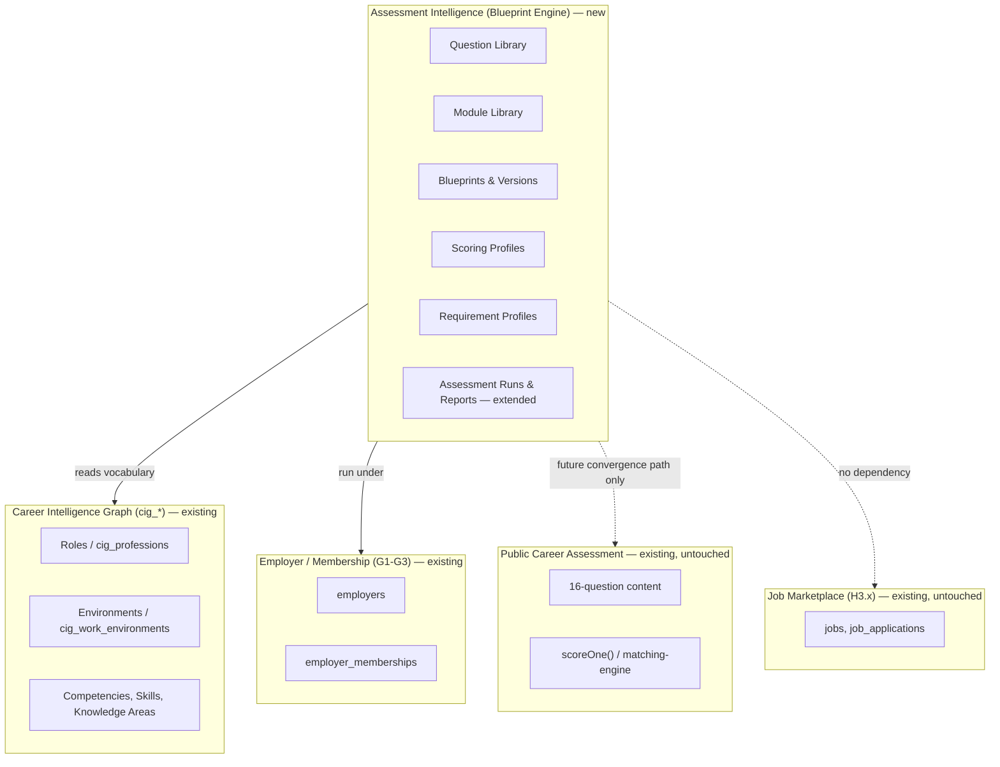
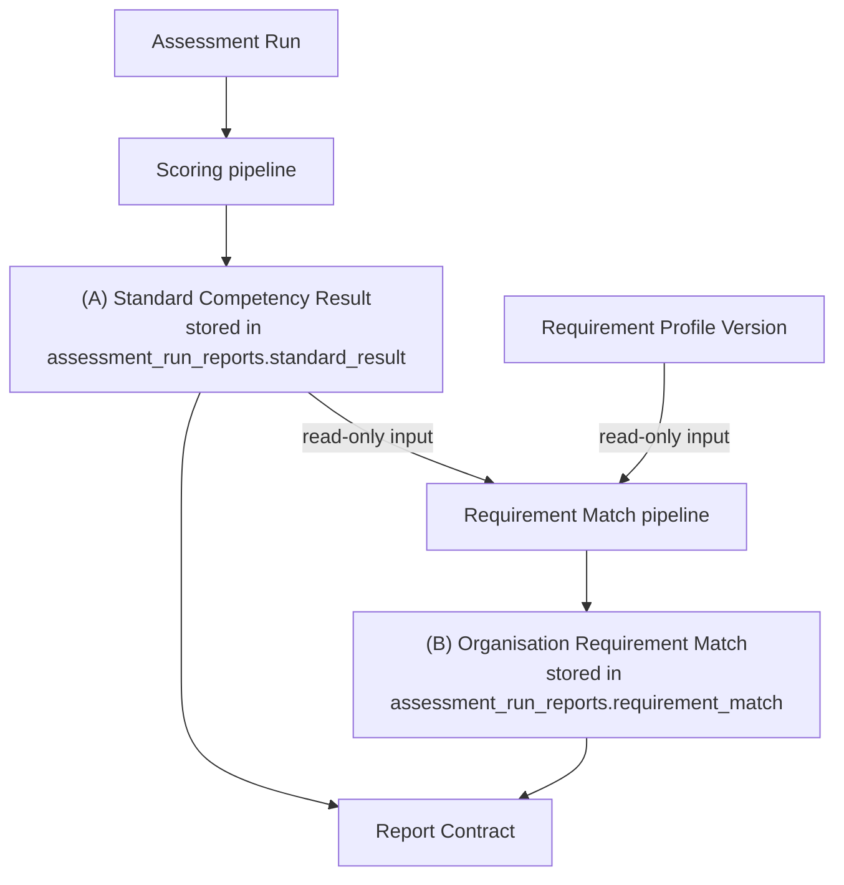

# Assessment Blueprint Engine — Domain-Driven Design

**Companion to:** [Architecture Review](./blueprint-engine-architecture-review.md) · [DB Schema](./blueprint-engine-db-schema.md)

> **Corrected per Architecture Quality Review** (findings C1, I1, I3,
> I5, L5 addressed in this document).

## 1. Bounded contexts

- **Assessment Intelligence** is a new bounded context. It *reads*
  Career Intelligence Graph vocabulary as its Role/Environment/
  Competency source of truth; it does not absorb or fork the graph.
- It is *invoked from within* an employer workspace (reuses G1-G3
  membership/RLS primitives) but owns none of the employer/membership
  data itself.
- It has **no dependency on** the Job Marketplace context.
- Its relationship to the **Public Career Assessment** context is
  read-only and structural-reuse-only in this build (shared lifecycle
  tables), with no data or route coupling — see §6.

## 2. Ubiquitous language

| Term | Definition |
|---|---|
| **Blueprint** | A reusable assessment "recipe" identity: Purpose + Role + Environment + Assessment Level, each a reference into a data-driven lookup/library table (fixes I1 — Purpose and Assessment Level are no longer hardcoded values). Module selection lives on the *Version* (fixes L5 — earlier drafts imprecisely listed it here), not on the Blueprint itself. Mutable while in draft. |
| **Blueprint Version** | An immutable snapshot of a Blueprint's Module selection, Question overrides, and default Scoring Profile at publish time. Mirrored 1:1 by an `assessment_versions` row at the moment of publish (fixes C1 — see §6a). Assessment Runs always reference a version, never the mutable draft head. |
| **Module** | A reusable, named composition of Questions mapped to Competencies (e.g. "Access Control"). Does not own its Questions — see §3. |
| **Module Version** | An immutable snapshot of a Module at publish time. |
| **Question** | A single assessment item. Reusable across Modules, Roles, Environments, Purposes. |
| **Question Version** | An immutable snapshot of a Question's wording/scale/options at publish time. |
| **Evidence Signal** | An atomic, named observation a Question Version can produce (e.g. "prefers structured routine"). Maps to one or more Dimensions/Competencies with a weight. |
| **Requirement Profile** | An org-owned overlay expressing competency-importance weighting. Never modifies the baseline Blueprint or its scoring — read-only comparison layer. |
| **Scoring Profile** | The deterministic rule set mapping Evidence Signals → Dimension/Competency scores for a given Blueprint Version. Exactly one Scoring Profile Version is `published` per Blueprint Version at a time for MVP (fixes I3 — earlier drafts left this ambiguous; multi-profile A/B support is explicitly deferred). |
| **Standard Competency Result (A)** | A participant's result against the Blueprint Version + Scoring Profile Version only. |
| **Organisation Requirement Match (B)** | A derived, read-only comparison of (A) against a selected Requirement Profile Version. |
| **Assessment Run** | One instance of a participant taking a Blueprint Version. Generalizes the existing `assessment_runs` table; its existing `status` values (`in_progress`/`completed`/`abandoned`) are reused unchanged (fixes C2). |
| **Purpose** | A row in the new `assessment_purposes` lookup table (fixes I1 — no longer a hardcoded value): Recruitment, Annual Competency Review, Supplier Audit, Post-Training Evaluation, Promotion Assessment, Certification, and (for the future convergence path, §6) `career_self_assessment`. A Blueprint references one Purpose row; adding a new Purpose is a data insert, not a schema change. |
| **Assessment Catalog Entry** | The pre-existing `assessments`/`assessment_versions` tables (predate this design). Every Blueprint mirrors exactly one `assessments` row, and every Blueprint Version mirrors exactly one `assessment_versions` row at publish time — this is what lets a Blueprint-driven run satisfy `assessment_runs`' existing `NOT NULL` `assessment_id`/`assessment_version_id` columns without a parallel catalog (fixes C1). |

## 3. Why not a linear hierarchy

Earlier drafts of this design used
`Question → Evidence → Dimension → Competency → Module → Blueprint`.
Rejected: the real domain is many-to-many at every layer. A single
Question Version may produce several Evidence Signals, contribute
differently to several Dimensions, belong to several Modules, be valid
for several Role/Environment/Purpose/Assessment-Level combinations,
carry different weights under different Scoring Profiles, and have
several language/content versions. A Module is a **composition
layer** — it references Questions through an association entity; it
never owns them.

```mermaid
erDiagram
    QUESTION_VERSIONS ||--o{ QV_EVIDENCE_SIGNALS : "produces"
    EVIDENCE_SIGNALS ||--o{ QV_EVIDENCE_SIGNALS : "produced by"
    QUESTION_VERSIONS ||--o{ QV_MODULE_VERSIONS : "included in"
    MODULE_VERSIONS ||--o{ QV_MODULE_VERSIONS : "includes"
    MODULE_VERSIONS ||--o{ MV_COMPETENCIES : "maps to"
    COMPETENCIES ||--o{ MV_COMPETENCIES : "mapped from"
    ROLES ||--o{ ROLE_COMPETENCY_REQ : "requires"
    ENVIRONMENTS ||--o{ ENV_COMPETENCY_REQ : "requires"
    BLUEPRINT_VERSIONS ||--o{ BV_MODULE_VERSIONS : "composed of"
    MODULE_VERSIONS ||--o{ BV_MODULE_VERSIONS : "used by"
    BLUEPRINT_VERSIONS ||--o{ BV_QUESTION_OVERRIDES : "include/exclude"
    QUESTION_VERSIONS ||--o{ BV_QUESTION_OVERRIDES : "overridden by"
    SCORING_PROFILE_VERSIONS ||--o{ SPV_WEIGHTS : "weights"
    REQUIREMENT_PROFILE_VERSIONS ||--o{ RPV_WEIGHTS : "weights"
```

## 4. Entity ownership, cardinality, versioning table

| Entity | Owner / source of truth | Cardinality | Versioned? | Immutable after publish? |
|---|---|---|---|---|
| Role | `cig_professions` (extended, `is_assessable` flag) | 1 row per role | No (graph rows are edited in place, `graph_version`-stamped) | No — graph convention, not Blueprint convention |
| Environment | `cig_work_environments` (extended, `is_assessable` flag) | 1 row per environment | No | No |
| Competency/Skill/Knowledge Area | `cig_competencies`/`cig_skills`/`cig_knowledge_areas` | shared vocabulary | No | No |
| Evidence Signal | New, Assessment Intelligence context | many per Question Version | No (leaf vocabulary, edited in place like `cig_*` rows) | No |
| Question | New, Assessment Intelligence context | 1 logical question, N versions | **Yes** | Draft mutable; published version frozen |
| Question Version | Assessment Intelligence context | 1 per publish | Yes (this *is* the version) | Yes, once published |
| Module | New, Assessment Intelligence context | 1 logical module, N versions | Yes | Draft mutable; published version frozen |
| Module Version | Assessment Intelligence context | 1 per publish | Yes | Yes |
| Blueprint | New, Assessment Intelligence context | 1 logical blueprint, N versions | Yes | Draft mutable; published version frozen |
| Blueprint Version | Assessment Intelligence context | 1 per publish | Yes | Yes — Assessment Runs pin to this |
| Scoring Profile | New, Assessment Intelligence context | **exactly 1 `published` per Blueprint Version at a time** (fixes I3 — structurally enforced by a partial unique index, not just "typically") | Yes | Yes, once published |
| Purpose / Assessment Level | New `assessment_purposes` / `assessment_levels` lookup tables (fixes I1) | shared vocabulary | No | No — same convention as Role/Environment |
| Assessment Catalog Entry (`assessments`/`assessment_versions`) | Pre-existing, reused as the bridge (fixes C1) | 1:1 mirror of each Blueprint / Blueprint Version | No (matches its existing convention) | `assessment_versions.retired_at` marks retirement, matching `archived` semantics |
| Requirement Profile | New, org-owned (via employer membership) | N per org | Yes | Yes, once published; org can create a new version, never edit a used one |
| Assessment Run | Extends existing `assessment_runs` | 1 per participant attempt | N/A (pins to Blueprint/Scoring Profile *version* IDs) | Immutable once submitted |
| Assessment Run Report | Extends existing `assessment_run_reports` | 1 per run | N/A | Immutable once generated; (A) and (B) sections separately stored |

All new association/join tables inherit `content_status`
(`draft`/`published`/`archived`, matching the existing `cig_*`
convention) and freeze once their parent version publishes — editing
requires a new version, never an in-place row update to a published
association.

## 5. Standard Result vs. Organisation Match — structural separation

Enforced structurally, not by convention alone:

- (A) and (B) are separate columns/sub-objects on
  `assessment_run_reports` (see [DB Schema](./blueprint-engine-db-schema.md)).
- The RPC that computes (B) (`compute_requirement_match()`) contains no
  code path that writes (A)'s columns — corrected per I7: this is
  enforced by the function's implementation and verified by code
  review/tests, the same trust boundary every other `SECURITY DEFINER`
  RPC in this codebase relies on, **not** by a Postgres column-level
  `GRANT` (a `SECURITY DEFINER` function runs with its owner's full
  privileges regardless of the caller's grants, so a grant-based
  barrier would not actually exist even if described). See
  [Backend §5](./blueprint-engine-backend.md#5-scoring-pipeline) for
  the corrected explanation.
- A Requirement Profile can never: modify baseline answers, modify
  baseline scoring rules, rewrite the standard result, or produce an
  automatic employment or supplier-compliance decision. It may only
  calculate and explain gaps or alignment against an organisation's
  selected priorities.

## 6. Public 16-question assessment — convergence path

**Stays separate in this build**: fully untouched — no shared route,
no shared question content, no rewrite of `scoreOne()` for its own
14-dimension model.

**Can safely share immediately** (structural reuse, zero behavior
change to the public assessment):
- `assessment_runs` / `assessment_run_reports` lifecycle tables — the
  public assessment already uses these; Blueprint runs extend them via
  a nullable `blueprint_version_id` rather than forking a new table.
- The Evidence Signal *model* (shape only — not the public
  assessment's actual signal data).
- The auditability/versioning pattern (immutable-once-published).
- `cig_*` dimension/competency vocabulary, where the public
  assessment's 14 `DimensionId`s already overlap it.

**Converges later, not now** (a separately-scoped future initiative):
- The 16 questions moving into `question_versions`/`module_versions`.
- Its scoring moving from the hardcoded 14-dimension `scoreOne()` onto
  a generalized Scoring Profile Version (parameterized by
  dimension/module set instead of a fixed list).
- Its report moving onto the shared (A)/(B) contract — it would only
  ever populate (A); there is no organisation Requirement Profile for
  a public candidate-side run.

**Migration/adapter path, when undertaken**: wrap the public assessment
as its own Blueprint referencing a `career_self_assessment` row in the
`assessment_purposes` lookup table (fixes I1/C1 — `career_self_assessment`
is now a legitimate, insertable Purpose value rather than a name that
contradicted the old CHECK-constrained `purpose` column) and a single,
always-published Blueprint Version — the exact same Assessment
Run/Report/versioning machinery applies with zero change to question
content, wording, or scale. "Port the shell, keep the content," not a
rewrite. **PO-confirmed**: this convergence stays deferred until the
Recruitment journey has been live and stable for a full quarter — not
part of this build.

**Duplication avoided in the meantime**: no second Question Library,
no second Assessment Run table, no second scoring core is built for
the org-side products now — `scoreOne()` is *generalized*
(parameterized) rather than forked, so the public assessment can adopt
the generalized version later with no scoring-logic rewrite required.

**Scale decision — not silently resolved**: production is 1–5; the
v1.2 draft states 1–10. Scale is modeled as a per-Question-Version
property, so the architecture is agnostic to this decision — it is
recorded as an open Product Owner decision (see [Architecture Review §8](./blueprint-engine-architecture-review.md#8-unresolved-product-owner-decisions)), not assumed.

## 7. Aggregate boundaries (for future implementation)

- **Blueprint aggregate**: Blueprint + its Blueprint Versions +
  BV↔ModuleVersion / BV↔QuestionVersion override associations. Publish
  is the only operation that crosses into immutability; enforced by
  `publish_blueprint_version()`.
- **Module aggregate**: Module + Module Versions + MV↔Competency
  associations + MV↔QuestionVersion associations owned from the Module
  side (which Question Versions this module currently includes).
- **Scoring Profile aggregate**: Scoring Profile Version + its
  Evidence/Dimension weight associations. One aggregate per published
  version — never mutated after publish.
- **Requirement Profile aggregate**: Requirement Profile Version + its
  Competency weight associations, owned by an `employer_id`.
- **Assessment Run aggregate**: the existing `assessment_runs` /
  `assessment_run_reports` pair, extended, not replaced. Pins
  `blueprint_version_id`, `scoring_profile_version_id`, and (when
  applicable) `requirement_profile_version_id` at run-start time.

## 8. Acceptance criteria (domain model)

- [ ] No entity in §4 marked "Immutable after publish? Yes" has any
      RLS `UPDATE` **or `DELETE`** policy on its published rows —
      verified against the
      [DB Schema](./blueprint-engine-db-schema.md#9-rls-model) RLS
      table (fixes C3, which found `DELETE` was previously
      unaddressed).
- [ ] A Question Version can be demonstrated (in design review) to
      belong to two different Module Versions simultaneously, and a
      Module Version to belong to two different Blueprint Versions
      simultaneously, without data duplication.
- [ ] (A) and (B) can be independently queried and independently
      absent — e.g. a public-assessment-shaped run (§6, future) that
      only ever has (A), never (B).
- [ ] Every published Blueprint has exactly one mirrored `assessments`
      row and every published Blueprint Version exactly one mirrored
      `assessment_versions` row (fixes C1) — no Blueprint can be
      published without one.
- [ ] At most one `scoring_profile_versions` row per
      `blueprint_version_id` is ever `published` simultaneously (fixes
      I3).
- [ ] A historical report's displayed Evidence Signal/Competency
      wording matches what was snapshotted at generation time even
      after the live `cig_*`/`evidence_signals` vocabulary is later
      edited (fixes I5).
