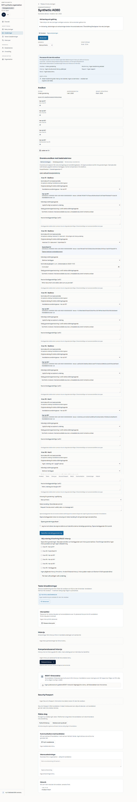
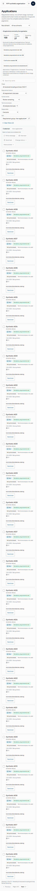

# Native100 backend pass, browser failure — exact 3ac evidence

The original manifest from [run 37773504814](https://github.com/cqrityjob/trust-path-recruitment/actions/runs/37773504814), job `113298573278`, artifact `11548837172` is byte-preserved. ZIP SHA256 is `789c550aa8348676b8e0cc51f218ef52603267593689e528e56665a3f7c2f9d9`. [Verification](verification.json) checks all 386 exact schema migration hashes and all nine original PNG hashes. Two original synthetic images are included.

Actual Auth104, Storage80 plus signed-byte readback, human100 40/25/35 and 27/73, API23/two real reviewers 200/409, changed profile, revoked/replaced originals, AI proposals staying gray and cascade/reset protection all passed. Browser execution failed; its exact exception and five-case stats were not exported. Do not inherit a browser or live acceptance pass from the backend results or these images.

A stale handoff locator is confirmed in exact source: saved source labels are in `s-saved-sources`, while the old test expected `s-setup` (canonical 446/generated 460). The forward test checks the exact saved-source ID/label and retains all remaining assertions. This static mismatch is distinct from an unavailable actual failure exception. A new run will publish only fixed case IDs/counts/source lines from the private JSON reporter.

Emulation is not a physical-phone test. No hosted Auth credentials, real candidate data or production write is part of this artifact.
